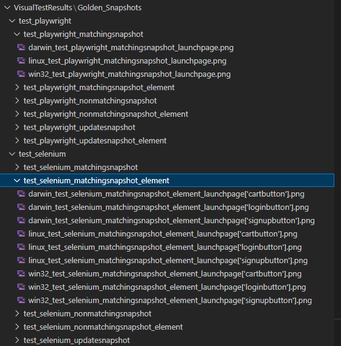
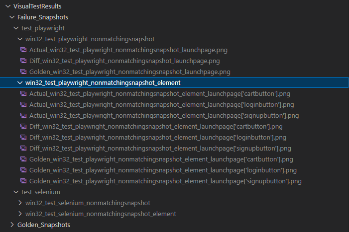
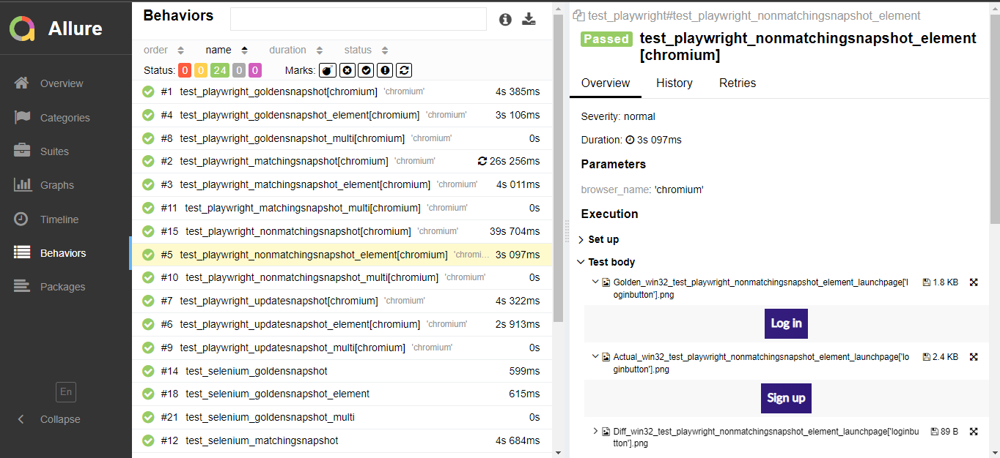
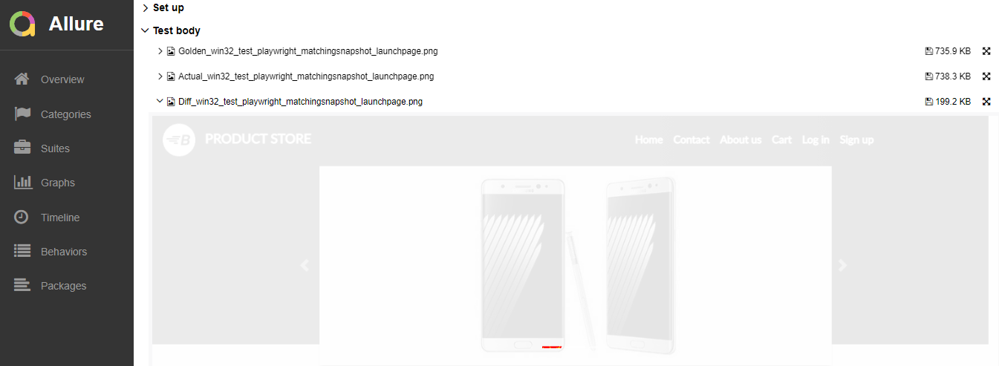

# pyviztest
## A Visual Test Automation Library in Python. Works with Playwright and Selenium. Integrable with Allure Report.
[](https://github.com/sanosuke009/pyviztest/actions/workflows/python-app.yml)

## Why Project pyviztest?

### Forewords
In Python there was no robust and integrable Visual Test Automation library/module. Thankfully, [Kumar Aaditya](https://github.com/kumaraditya303) created a [pytest fixture](https://pypi.org/project/pytest-playwright-snapshot/) for [Playwright](https://playwright.dev/python/) using the power of [pixelmatch library](https://pypi.org/project/pixelmatch/) for Visual Testing, and [Symon Storozhenko](https://github.com/symon-storozhenko) enhanced it to create [pytest-playwright-visual](https://pypi.org/project/pytest-playwright-visual/). I really loved both, so I tried to realign the same concept by developing a library and added a few more functionality to make the use of it more flexible, and also compatible with [Playwright](https://playwright.dev/python/) and [Selenium](https://www.selenium.dev/). All thanks go to both of them for being the harbinger of the visual testing libraries in python. I merely followed the path and improvized.

### Features
#### So, previously created [pytest-playwright-visual](https://pypi.org/project/pytest-playwright-visual/) had the power to be summoned anywhere inside the tests which had it as a parameter, and to
1. - [x] Create Golden Snapshot (The reference image of the UI which needs to be compared with during test execution) of the AUT(Applicayion under test).
2. - [x] Update existing Golden Snapshot.
3. - [x] Take snapshot in runtime and compare it with the Golden Snapshot. If both do not match, it creates an image where the difference is highlighted.

#### In addition to these features, pyviztest is capable of doing a few more things!
4. - [x] Supports Windows, Linux and MacOS systems.
5. - [x] Supports Playwright and Selenium. You just need to provide the Page and WebDriver instances.
6. - [x] Supports custom snapshot directories.
7. - [x] Supports option to Create & Update snapshots(particular and all) without failing the tests.
8. - [x] Supports option to add multiple snapshot validation in a single test case, and if one of them fails it will still validate others.
9. - [x] Supports integration with Allure Report.
10. - [x] Supports auto-naming of the snapshots with respect to the test suite and test case name.
11. - [x] Provides api to return Golden, Actual and Difference Snapshots in bytes, to easily integrate with any custom report.
12. - [x] Supports comparing images with different in sizes without failing the test abruptly.
13. - [x] Supports comparing snapshots of multiple web elements together or the full page.

### Upcoming Next:
1. - [ ] Support for Appium.
2. - [ ] Support for element specific identification.
3. - [ ] A fixture along with the usual library.

## How To Use It:

### Installing
Simple and easy to install because it's just another python library! Install using below pip command:
```bash
    $ pip install pyviztest
```
### Configuration
1. **_Required:_** Import VisualTest from pyviztest.viztest
```python
    from pyviztest.viztest import VisualTest
```
2. **_Required:_** The object of VisualTest is the driving factor of the visual tests.
```python
    visualtest = VisualTest(driverpage=driver)
```
> **Note**
> You may directly create an object of VisualTest class for each test separately and proceed with that object, or you can create a pytest fixture for dependency injection to initialize the VisualTest instance from inside that class. Using a separate class/fixture to implement dependency injection is always recommended.
The constructor of VisualTest class can take 5 arguments i.e. `snapshot_path`, [MANDATORY]`driverpage`: WebDriver/Page, `updatesnapshot`, `savefailuresnapondisk` & `allurereport`. The usage of them are elaborated in below code snippet comments.
```python
    class VisualTest(
        snapshot_path: str = '', #The path where all the snapshots will reside. If not provided, it will consider the parent directory of the test class as the snapshot path by default.
        driverpage: Any = '', #You MUST to provide either the driver object (if you are using Selenium for your tests) or page fixture/object (if you are using Playwright)
        updatesnapshot: bool = False, # If True, it will update all the existing golden snapshots or to create new golden snapshots for the current session of Visualtest class.
        savefailuresnapondisk: bool = True, #If True, all the failure snapshots will be saved inside the failure directories under snapshot_path as image files in PNG format.
        allurereport: bool = False #If True, allure report will be generated with Golden snapshots and failure snapshots.
    )
```
3. **_Required:_** Invoke the setpaths() function for each of the tests.
```python
    visualtest.setpaths()
```
> **Note**
> The setpaths function can take 2 optional arguments i.e. `updatesnapshot` and `numberofclassesaftertestclass`. The usage of them are elaborated in below code snippet comments.
```python
    (method) def setpaths(
        updatesnapshot: bool = False, # Same as the updatesnapshot mentioned above. It provides the flexibility to update snapshots for a particular test case. If not given, it would take the default value during creation of VisualTest class object.
        numberofclassesaftertestclass: int = 0  # This parameter defines the number of classes between the test methods and where the visualtest_web() method is invoked.
    ) -> None
```
> **Warning**
> `numberofclassesaftertestclass` parameter helps you to fetch the testcase name in order to generate the snapshot's name by default if you are not providing any specific name. By default the value of it is 0, that means it assumes that the visualtest_web() method is being invoked from inside the test mthod directly without any further abstraction. If you add _N_ number of abstractions, then you should provide the value of the parameters as _N_. See point no. 4 for more info.
```python
    visualtest.setpaths(numberofclassesaftertestclass=N)
```
4. Now that the configuration is done, you have to invoke `visualtest_web()` method wherever the webpage snapshots need to be validated.
```python
    assert vt.visualtest_web(stepname="validateloginpage")
```
> **Note**
> This method takes a minimum of 7 arguments i.e. `stepname`, `threshold`, `fail_fast`, `updatesnapshot`, `fullpage`, `snapshot_of_locators` and `exclude_locators`. The usage of them are elaborated in below code snippet comments.
```python
    (method) def visualtest_web(
        *,
        stepname: str = '', # Optional, but it is recommended to provide the value to distinguish snapshots
        threshold: float = 0.1, # Optional, sets the threshold for the comparing the snapshots 0 to 1
        fail_fast: bool = False, # Optional, if you'd like to fail the comparison even if 1 pixel doesn't match, make it True
        updatesnapshot: bool = False, # Same as the updatesnapshot mentioned above. It provides the flexibility to update snapshots for a particular test step. If not given, it would take the default value during creation of VisualTest class object or setpaths().
        fullpage: bool = True, # Optional, to take snapshot of the full page or not
        snapshot_of_locators: list = [], # Optional, you may send set of locators or webelements to take snapshots of only those elements instead of a full page snapshot
        exclude_locators: list = [] # Optional, you may send set of locators to mask them in the snapshots, so during the comparison they will be excluded.
    ) -> bool
```
> **Warning**
> `fullpage` and `exclude_locators` are only applicable for **Playwright** tests. They **do not work** for **Selenium** tests.
> **Note**
> This `visualtest_web()` method returns a boolean value as per below table:
| updatesnapshot(VisualTest()) | updatesnapshot(setpaths()) | updatesnapshot(visualtest_web()) | Snapshots Match? | visualtest_web() |
| :----------: | :----------: | :----------: | :----------: | :----------: |
| True | - | - | - | True |
| False | True | - | - | True |
| False | False | True | - | True |
| False | False | False | True | True |
| False | False | False | False | False |

> **Warning**
> ### Do not Change the value of `numberofclassesaftertestclass` if you don't understand the below concept well.
> As mentioned above already, `numberofclassesaftertestclass` parameter helps you to fetch the testcase name in order to generate the snapshot's name by default if you are not providing any specific name. Let's look at an example:
```python
       Project|
              |---src|
              |       |--testsuitename|
              |                       |---test_playwright.py|
              |                       |                     |---test_1()
              |                       |                     |---test_2()
              |                       |
              |                       |---test_selenium.py|
              |                                           |---test_1()
              |                                           |---test_2()
              |---VisualTestResults                     
```
> In case of the folder structure depicted above, if the OS is Linux, `snapshot_path` is `VisualTestResults`, and the `visualtest_web()` method is invoked from the `test_1()` and `test_2()` methods, then the name of the Golden snapshot created for `test_1()` in `test_playwright.py` will be `linux_test_1.png` and it will reside inside **_VisualTestResults/Golden_Snapshots/test_playwright/test_1/linux_test_1.png_**. So after the execution if `updatesnapshot` = **True**, the folder structure will be like below:
```python
       Project|
              |---src|
              |       |--testsuitename|
              |                       |---test_playwright.py|
              |                       |                     |---test_1()
              |                       |                     |---test_2()
              |                       |
              |                       |---test_selenium.py|
              |                                           |---test_1()
              |                                           |---test_2()
              |---VisualTestResults|
                                   |---Golden_Snapshots|
                                                       |---test_playwright|
                                                                          |---test_1|
                                                                          |         |---linux_test_1.png  
                                                                          |  
                                                                          |---test_2|
                                                                                    |---linux_test_2.png           
```
> Now, let's look at a different folder structure below:
```python
       Project|
              |---src|
              |       |--testsuitename|
              |                       |---test_playwright.py|
              |                       |                     |---test_1()|
              |                       |                     |           |--validate_launchpage()|
              |                       |                     |                                   |--validate_loginbutton()
              |                       |                     |---test_2()|
              |                       |                                 |--validate_loginpage()|
              |                       |                                                         |--validate_homepage()
              |                       |
              |                       |---test_selenium.py|
              |                                           |---test_1()
              |                                           |---test_2()
              |---VisualTestResults                     
```
> Here, the `visualtest_web()` method is invoked from `validate_loginbutton()` and `validate_homepage()` methods instead of the `test_1()` and `test_2()` methods. then the name of the Golden snapshot created for `validate_loginbutton()` will be `linux_validate_loginbutton.png` and it will reside inside **_VisualTestResults/Golden_Snapshots/validate_launchpage/validate_loginbutton/linux_validate_loginbutton.png_**. Now clearly, if we want the name of the test folders to be of the test method's name, then we should initialize `numberofclassesaftertestclass` = 2. (2 because there are 2 invoked methods between the test method `test_1()` and `validate_loginbutton()`).
```python
    visualtest.setpaths(numberofclassesaftertestclass=2)
```

### Example Code
#### Playwright:
```python
    from playwright.sync_api import Page
    import pytest
    from pyviztest.viztest import VisualTest

    @pytest.fixture(scope="function", autouse=True)
    def before_each(page:Page):
        page.goto(url=url)
        yield

    def test_playwright_updatesnapshot(page:Page) -> None:
        # Create an object of VisualTest class
        # with parameters ->
        # @snapshotpath where all the Golden and other snapshots will be stored
        # @driverpage where you have to provide the page fixture of Playwright
        # @updatesnapshot a boolean value, make it True if you'd like to update all the snapshots
        # @savefailuresnapondisk a boolean value, make it True if you'd like to save all the snapshots as image files
        # @allurereport  boolean value, make it True if you'd like to generate allure report with the snapshots
        vt = VisualTest(snapshot_path=visualtestresults, driverpage=page, updatesnapshot=False, 
                        savefailuresnapondisk=False, allurereport=True)
        # setpaths() function must to be invoked before summoning any visualtest method
        # @updatesnapshot parameter will override the default updatesnapshot value set during 
        # VisualTest object creation
        vt.setpaths(updatesnapshot=True)
        page.wait_for_load_state(state='networkidle')
        page.wait_for_selector(id_header_productstore)
        assert page_title in page.url
        # For visual testing for any Web app you need to invoke visualtest_web() function
        assert vt.visualtest_web(stepname="launchpage")
```
#### Selenium:
```python
    from playwright.sync_api import Page
    import pytest
    from pyviztest.viztest import VisualTest

    @pytest.fixture (scope="function", autouse=True)
    def browser():
        driver = webdriver.Chrome()
        driver.get(url=url)
        yield driver
        driver.quit()

    def test_selenium_updatesnapshot(browser) -> None:
        # Create an object of VisualTest class
        # with parameters ->
        # @snapshotpath where all the Golden and other snapshots will be stored
        # @driverpage where you have to provide the page fixture of Playwright
        # @updatesnapshot a boolean value, make it True if you'd like to update all the snapshots
        # @savefailuresnapondisk a boolean value, make it True if you'd like to save all the snapshots as image files
        # @allurereport  boolean value, make it True if you'd like to generate allure report with the snapshots
        vt = VisualTest(snapshot_path=visualtestresults, driverpage=browser, updatesnapshot=False, 
                        savefailuresnapondisk=False, allurereport=True)
        # setpaths() function must to be invoked before summoning any visualtest method
        # @updatesnapshot parameter will override the default updatesnapshot value set during 
        # VisualTest object creation
        vt.setpaths(updatesnapshot=True)
        headerelement = browser.find_element(By.XPATH, xpath_header_productstore)
        assert page_title in browser.current_url
        assert headerelement.is_displayed()
        # For visual testing for any Web app you need to invoke visualtest_web() function
        assert vt.visualtest_web(stepname="launchpage")
```
### Execution
#### First Time: 
When the Golden Snapshots (the reference snapshots with which the execution snapshots will be compared) are not existing, then you have to create them first. So make the value of `updatesnapshot` as `True` and call the pytest command in command line interface.
```bash
$ pytest
```
After the execution, you will see that the Golden Snaphots will be generated in your project directory where you have set your `snapshot_path`.

#### Second Time onwards/For snapshot validation:
Make the value of `updatesnapshot` as `False` and call the pytest command in command line interface.
```bash
$ pytest
```
After the execution, if the value of `savefailuresnapondisk` is `True`, you will see that the Failure Snaphots will be generated in your project directory where you have set your `snapshot_path`. If no test case fails, no Failure Snapshot would be generated. If the value of `savefailuresnapondisk` is `False`, Snapshot files will not be generated.

Now, if `allurereport` = `True`, then you can generate allure report but you have to run below command:
```bash
$ pytest --alluredir=allure-results
```
followed by 
```bash
$ allure serve .\allure-results\
```
Then you will be able to see the generated allure reports with pass and failure reports with mismatch snapshots.


#### To Update Golden Snapshots:
If you want to update the Golden Snapshots of all the validations in a single VisualTest() session, then make the value of `updatesnapshot` as `True` while creating a `VisualTest()` object. You'd have the option to do the same for `setpaths()` and `visualtest_web` methods as well. Then call the pytest command in command line interface.
```bash
$ pytest
```
After the execution, the Golden Snapshots of the targeted test cases will be replaced with new snapshots.

